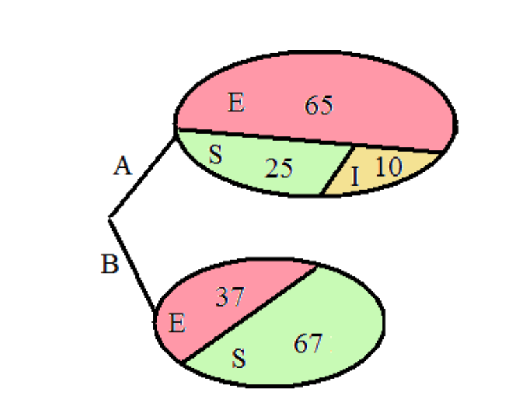
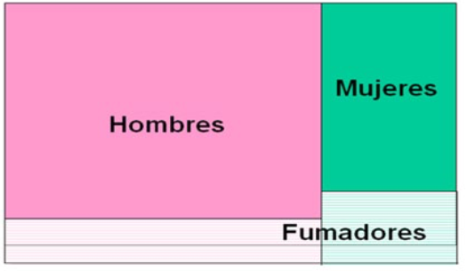
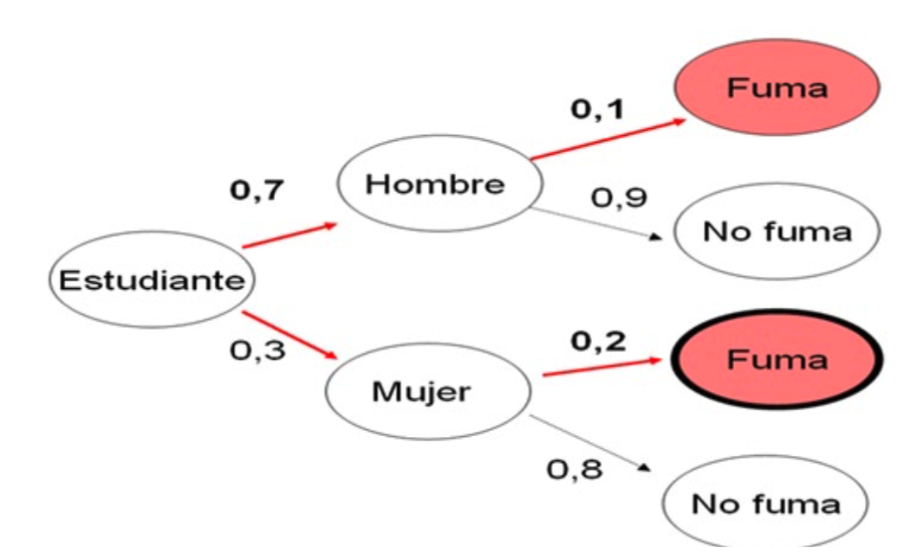

# Probabilidad

## Ejercicio 1

><span style="color:red; font-size: 20px;">**EJEMPLO**</span>

```{r}
Nombre <- c("B.R.", "C.C", "C.G", "G.P", "M.P", "J.L", "L.A", "N.D", "V.C", "V.F", "L.L", "J.N", "J.P", "U.P")
Sexo <- c("H", "M", "H", "M", "M", "H", "M", "M", "H", "H", "H", "M", "M", "M")
Edad <- c(18, 19, 19, 20, 21, 20, 21, 21, 22, 19, 18, 21, 21, 18)

# Combine variables into a data frame
dt <- data.frame(Nombre, Sexo, Edad)

table(Sexo)

P_A <- sum(dt$Sexo=="H")/length(dt$Sexo)
P_B <- sum(dt$Edad<20)/length(dt$Edad)
P_AoB <- sum(dt$Sexo=="H" & dt$Edad<20)/dim(dt)[1]
P_AyB <- P_A + P_B - P_AoB
```

## Ejercicio 2

><span style="color:red; font-size: 20px;">**EJEMPLO**</span>

```{r}
# Se crea la tabla de contingencia
dat <- matrix(c(60, 8, 68, 140, 792, 932, 200, 800, 1000), nrow = 3, byrow = TRUE)

# Se añaden los nombres a las filas y columnas
rownames(dat) <- c("Glocosaria", "No Glucosaria", "Total")
colnames(dat) <- c("Diabetes", "No Diabetes", "Total")

# Visualizamos la tabla
print(dat)

P_Glucosaria <- dat[1,3]/ dat[3,3]
P_Glucosaria

P_SerDiabetico <- dat[3,1]/ dat[3,3]
P_SerDiabetico

P_Glucosaria_Diabetico <-  (dat[1,1]/dat[3,3])/(dat[3,1]/dat[3,3])
P_Glucosaria_Diabetico

P_Glucosaria_No_Diabetico <- (dat[1, 2]/dat[3,3])/(dat[3,2]/dat[3,3])
P_Glucosaria_No_Diabetico

P_NoGlucosaria_Diabetes <- (dat[2,1]/dat[3,3])/(dat[3,1]/dat[3,3])
P_NoGlucosaria_Diabetes

P_SerDiabetico * P_Glucosaria

P_GlucosariayDiabetes <- dat[1,1]/dat[3,3]
P_GlucosariayDiabetes

# Como P(Glocosuria∩Diabetes)≠P(Glucosuria)P(Diabetes) significa que no son independientes.
```

## Ejercicio 3

><span style="color:red; font-size: 20px;">**EJEMPLO**</span>

Un médico de pueblo tiene la misma probabilidad de visitar el pueblo A que el B, tras un brote de gripe, en el pueblo A hay gente enferma, incubando con síntomas leves la enfermedad o sana y en el B sólo hay gente enferma y sana. Si el médico solo visita a un paciente de forma aleatoria. Define el especio muestral. Calcular la probabilidad de: a) visitar a un enfermo, b) visitar a un individuo incubando la enfermedad.

```{r, eval = TRUE, out.width="40%", echo=FALSE, fig.align='center'}

```

P(E)=(AE,AI,AS,BE,BS)

```{r}
P_Enfermo <- (1/2) * (65/100) + (1/2) * (37/104)
P_Enfermo

P_Incubando <- (1/2) * (10/100)
P_Incubando
```

## Ejercicio 4

><span style="color:red; font-size: 20px;">**EJEMPLO**</span>

```{r, eval = TRUE, out.width="40%", echo=FALSE, fig.align='center'}

```

```{r, eval = TRUE, out.width="40%", echo=FALSE, fig.align='center'}

```

$P(Fumar)= P(Hombre\;|\;Fumar) + P(Mujer\;|\;Fumar) =$

$= P(Fumar\;|\;Hombre)\;x\;P(Hombre)\;+\;P(Fumar\;|\;Mujer)\;x\;P(Mujer)=$

```{r}
(0.1*0.7) + (0.2*0.3)
```

$P(Mujer\;|\;Fumar)= \frac{P(Mujer\;\cap\;Fumar)}{P(Fumar)}=\frac{P(Fumar\;|\;Mujer)\;x\;P(Mujer)}{P(Fumar)}$

```{r}
(0.3*0.2)/((0.1*0.7) + (0.2*0.3))
```


## Ejercicio 5

><span style="color:red; font-size: 20px;">**EJEMPLO**</span>

Calcular: sensibilidad, especificidad, valor predictivo positivo y valor predictivo negativo. 

```{r}
# Se crea la tabla de contingencia
dat <- matrix(c(15, 4, 19, 5, 34, 39, 20, 38, 58), nrow = 3, byrow = TRUE)

# Se añaden los nombres a las filas y columnas
rownames(dat) <- c("Positive RX", "Negativo RX", "Total")
colnames(dat) <- c("Cáncer", "No cáncer", "Total")

# Visualizamos la tabla
print(dat)

P_TestPos_Enfermo <- (dat[1,1]/dat[3,3])/(dat[3,1]/dat[3,3])
P_TestPos_Enfermo # la prueba tiene una sensibilidad del 75%

P_TestNeg_NoEnfermo <- (dat[2,2]/dat[3,3])/(dat[3,2]/dat[3,3])
P_TestNeg_NoEnfermo # la prueba tiene una especificidad del 89%

P_Enfermo_TestPos_VPP <- (dat[1,1]/dat[3,3])/(dat[1,3]/dat[3,3])
P_Enfermo_TestPos_VPP # la prueba tiene una especificidad del 89%

P_NoEnfermo_TestNeg_VPN <- (dat[2,2]/dat[3,3])/(dat[2,3]/dat[3,3])
P_NoEnfermo_TestNeg_VPN # la prueba tiene una especificidad del 89%

```

## Ejercicio 6

><span style="color:red; font-size: 20px;">**EJEMPLO**</span>

Con el siguiente ejemplo vamos a calcular la probabilidad de sacar 1, 2, 3, 4, 5 y 6 en un dado.

```{r}
# Definimos el número de tiradas
num_rolls <- 10000

# Simulamos en lanzamiento de una dado justo de 6 caras.
results <- sample(1:6, num_rolls, replace = TRUE)

# Contamos el resultado que obtenemos de cada lanzamiento.
counts <- table(results)

# Calculamos la probabilidad
probabilities <- counts / num_rolls

# Presentamos los resultados
for (i in 1:6) {
  print(paste("La probabilidad de conseguir un", i, ":", probabilities[i]))
}
```

## Ejercicio 7

><span style="color:red; font-size: 20px;">**EJEMPLO**</span>

a) Ejemplo unión o suma: P(A∪B) = P(A) + P(B) - P(A∩B)

- Evento A: Obtener un número par en un dado justo de seis caras.
- Evento B: Obtener un número mayor que 3 en el mismo dado.

```{r}
# Simulando el lanzamiento de un dado justo de seis caras.
n_simulations <- 100000  # número de simulaciones
rolls <- sample(1:6, n_simulations, replace = TRUE)

# Definición de los eventos A y B
event_A <- rolls %% 2 == 0  # números pares
event_B <- rolls > 3  # números mayores que 3

# Cálculo de probabilidades de eventos A y B
probability_A <- sum(event_A) / n_simulations
probability_B <- sum(event_B) / n_simulations

# Cálculo de la interseccón de los eventos A y B
probability_intersection <- sum(event_A & event_B) / n_simulations

# Utilización de la propiedad P(A∪B) = P(A) + P(B) - P(A∩B) para el cálculo de la suma
probability_union_formula <- probability_A + probability_B - probability_intersection

# Mostrar resultados
cat("Probabilidad de A:", probability_A, "\n")
cat("Probabilidad de B:", probability_B, "\n")
cat("Probabilidad de (A ∩ B):", probability_intersection, "\n")
cat("Probabilidad de (A ∪ B) utilizando la formula:", probability_union_formula, "\n")
```

b) Ejemplo intersección o producto: P(A∩B)=P(A)+P(B)−P(A∪B)

```{r}
# Definir el espacio muestral para un dado individual.
sample_space <- 1:6

# Definir el Evento A: Obtener un número par en el primer dado.
event_A <- c(2, 4, 6)

# "Definir el Evento B: Obtener un número mayor que 3 en el segundo dado.
event_B <- c(4, 5, 6)

# Calcular probabilidades
P_A <- length(event_A) / length(sample_space)
P_B <- length(event_B) / length(sample_space)

# Calular la unión de los eventos A y B
event_union <- union(event_A, event_B)
P_union <- length(event_union) / length(sample_space)

# Calcular la intersección de los eventos A y B
P_intersection <- P_A + P_B - P_union

# Mostrar resultados
cat("P(A) =", P_A, "\n")
cat("P(B) =", P_B, "\n")
cat("P(A∪B) =", P_union, "\n")
cat("P(A∩B) =", P_intersection, "\n")
```

[@Gonzalez2020]

